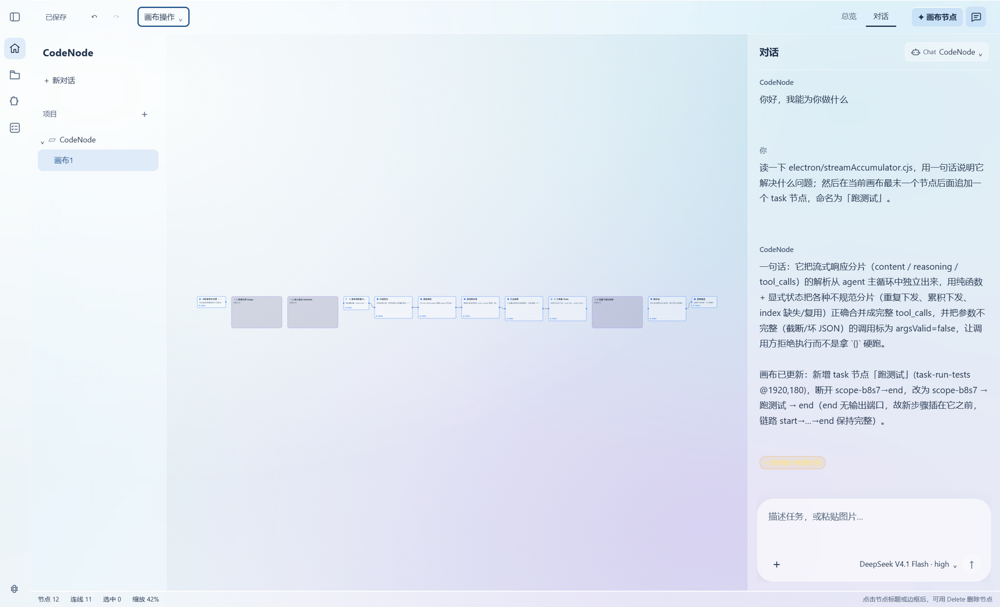
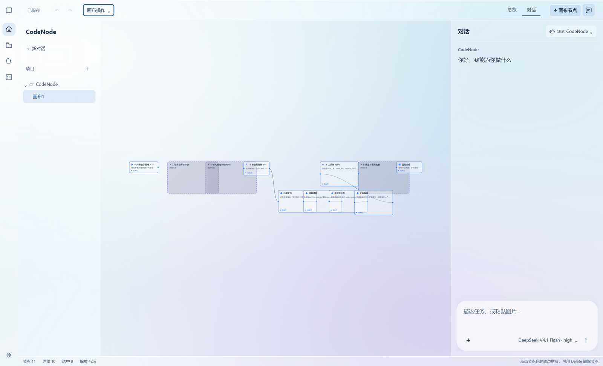
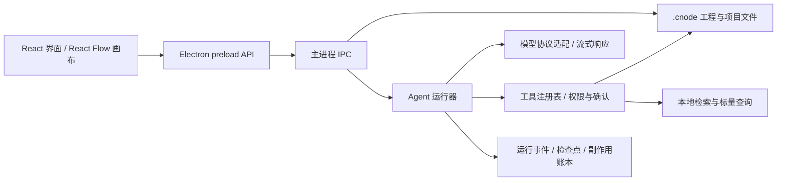
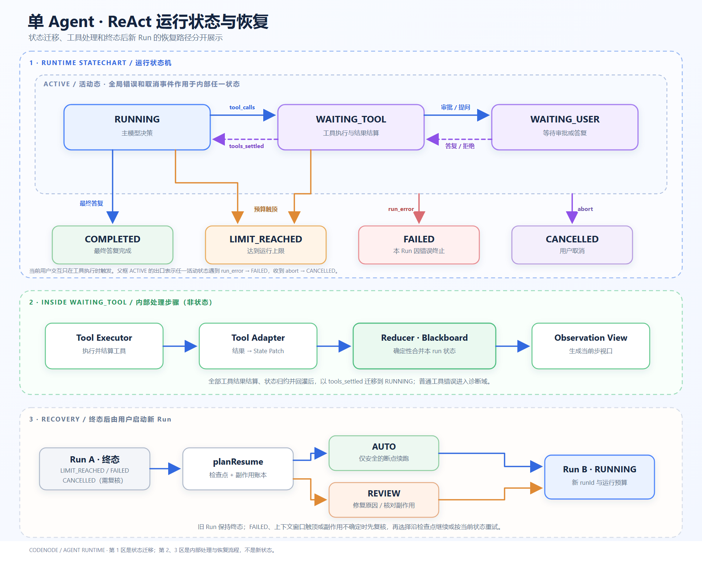
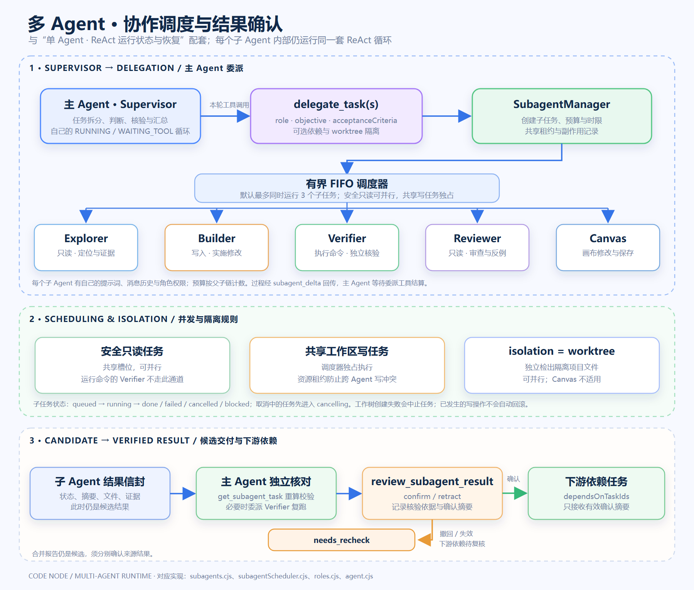

# CodeNode

CodeNode 是一个面向本地工程的桌面 Agent 工作台：左侧与 Agent 对话，中央用节点和连线组织工作流，底部查看文件、终端、运行记录与恢复计划。Agent 能读取项目、调用受控工具、修改代码或画布，并把执行结果留在工程里。

本仓库的 `yimi-branch` 使用 Electron + React + React Flow。这里的 **ReAct** 指 Agent 的“模型判断 → 调用工具 → 观察结果 → 再判断”循环；它与前端的 React 框架不是同一个概念。

> 想先用起来：看 [快速开始](#快速开始) 和 [第一次操作](#第一次操作)。想理解系统怎样运行：看 [架构](#架构)。

## 快速开始

### 环境

- Node.js **22**（见 `.nvmrc` 和 `package.json`）。
- npm；首次安装依赖与 Electron 需要联网。
- Windows、macOS 或 Linux 桌面环境。只打开 Vite 网页不能使用文件、工程和 Agent 功能，需启动 Electron。

```powershell
git clone --branch yimi-branch https://github.com/ZhuanTou33212/CodeNode.git
cd CodeNode
npm ci
npm run dev
```

`npm run dev` 同时启动 Vite 和 Electron。Windows 也可双击仓库根目录的 `启动项目.bat`，它会检查依赖并运行开发模式。首次编译或启动失败时，先确认终端使用的是 Node 22，再查看终端错误。

要以构建产物启动：

```powershell
npm run start:prod   # 先构建，再启动 Electron
```

`npm start` 只加载已有的 `dist/`，不会替你重新构建。发行包构建命令见 [开发与打包](#开发与打包)。

## 第一次操作

1. **进入工程。** 启动页选“新建工程”创建 `.cnode`，或选“打开工程”指定已有代码目录；已有 `.cnode` 可用“打开工程文件”。右侧“最近打开”需手动点选，不会在启动时自动进入上次工程。
2. **配置模型。** 在左侧 **Agent** 页的模型下拉框选“管理模型…” → “+ 新增模型”，填写显示名称、模型 ID、API 地址和 API Key，保存后点“设为当前模型”。本地服务可按其认证方式配置。协议会按地址识别常见的 OpenAI 兼容、Anthropic、Gemini 与 Azure 端点；高级覆盖项见 `config/agent.properties.example`。
3. **先发一个只读请求。** 例如“帮我找到项目的入口文件，说明它如何启动，并给出文件路径”。输入框按 **Enter** 发送，**Shift+Enter** 换行。左侧会显示模型输出与工具调用；修改文件、运行命令等操作可能弹出确认。
4. **让 Agent 做具体任务。** 例如“检查登录流程中的错误处理，先说明拟改哪些文件，再做最小修改”。运行中可用“插话”给下一轮追加纠偏信息，或点“停止”中止。
5. **保存工程。** 点击顶部“保存”或按 **Ctrl+S**。`.cnode` 保存画布、会话及工作区等工程数据；项目源码仍在所选目录中。



### 在画布上编排并运行工作流

1. 在空白画布按 **Shift+A** 添加节点。最简单的链路是 `start → task → end`：从右侧输出端口拖线到下一个节点左侧输入端口。
2. 选中任务节点，在左侧“节点”标签填写目标或 Prompt；复杂工作可用 `stage` 表示阶段、`scope` 包住分支或循环、`tool` 表示工具步骤。
3. 点顶部“运行”，在底部“连续执行”页点“运行工作流”。工作流按连线拓扑执行；失败或停止后可点“继续运行”处理未完成节点。“数据流”按钮只计算节点输入/输出，不会启动 Agent 工作流。
4. 用“自动整理”整理节点，点“保存”写入工程。`Ctrl+Z` / `Ctrl+Y` 可撤销或重做节点编辑。

画布是工程工作区；聊天里的子 Agent 是由主 Agent 通过委派工具启动的独立任务。**画一个 `stage` 节点不等于立即启动一个子 Agent**，运行画布工作流与模型在聊天中委派任务也不是同一条执行路径。



### 让多个 Agent 分工

在 Agent 输入框里描述分工和验收标准即可，例如：

> 请先只读定位配置加载流程；由实现角色只修改发现的问题；再独立运行相关检查并审查边界情况。最后列出改动文件、验证依据和未解决的问题。

主 Agent 可按任务需要调用 `delegate_task` 或 `delegate_tasks`。这由模型和工具循环决定，界面没有“强制启动五个角色”的按钮。工具记录与底部“运行”页可查看子任务状态；子 Agent 的自述先作为**候选结果**返回，主 Agent 核对并确认后才能作为后续依赖任务的可信摘要。

### 中断后继续

在底部“运行”页找到“可恢复的 Agent 运行”，点“查看恢复计划”：

- **自动续跑**：检查点表明待办步骤可安全继续；已提交的写操作会被跳过。
- **人工复核后续跑**：存在结果未知的副作用或待确认写操作；先核对当前文件与外部状态，再选“按当前状态重试”或在了解风险后选择强制续跑。
- **工作流节点继续运行**：这是画布工作流的进度恢复，入口同样在“运行”页，与 Agent Run 的断点续跑分开。

旧 Run 保留原状态；继续时创建新的 Run，不会把失败记录改写成成功。

## 架构

### 桌面端与数据流



| 层 | 职责 | 主要代码 |
| --- | --- | --- |
| 渲染层 | 对话、画布、文件树、运行与恢复界面 | `src/components/`、`src/store/` |
| preload 与 IPC | 向界面暴露受控 API，连接主进程 | `electron/preload.cjs`、`electron/ipc/` |
| Agent 运行器 | ReAct 循环、流式调用、上下文与运行状态 | `electron/agent.cjs`、`electron/agentState.cjs` |
| 工具与子代理 | 参数契约、权限、确认、调度和结果审查 | `electron/tools/`、`electron/subagents.cjs` |
| 工程与恢复 | `.cnode` 编解码、Run 事件、检查点、幂等记录 | `electron/cnode.cjs`、`electron/runStore.cjs`、`electron/runCheckpoint.cjs` |
| 检索 | 项目文件索引、BM25/向量检索、标量查询 | `electron/rag/`、`electron/vectorStore/`、`electron/scalars/` |

### 单 Agent：ReAct 状态机



一次 Agent Run 从 `RUNNING` 开始。模型若给出最终答复，进入 `COMPLETED`；若提出工具调用，则在本轮流式响应结束并完成结构校验后进入 `WAITING_TOOL`，执行工具并将结果作为 `tool` 消息写回对话，再回到 `RUNNING`。需要审批或向用户提问时进入 `WAITING_USER`。`FAILED`、`CANCELLED` 和 `LIMIT_REACHED` 是其他终态。

图中的 **ACTIVE 是为了阅读方便画出的活动态分组，不是代码里的第八个状态**。普通工具失败通常会作为工具结果交给模型判断下一步；流损坏、运行错误、用户取消或预算触顶才按各自终止规则处理。流式 `tool_call` 会先累加与校验，参数未完成或本轮因长度截断时不会直接执行。可选的 Observation/Blackboard 会把一轮工具结果整理成当前观察摘要，但不替代原始工具记录。

恢复由 `runStore` 事件、`runCheckpoint` 检查点和 `sideEffects` 幂等账本共同决定。`planResume` 把旧 Run 分成可自动续跑、需人工复核、已完成或无法判断；结果未知的外部副作用不会被盲目重放。

### 多 Agent：主 Agent 委派与确认



主 Agent 本身仍执行上面的 ReAct 循环。它调用 `delegate_task` / `delegate_tasks` 时，`SubagentManager` 为子任务建立各自的提示词、对话、角色权限、时限和预算，并再次调用同一个 `runAgentChat`。子任务不是把主 Agent 的上下文完整复制一份。

| 角色 | 负责什么 | 主要边界 |
| --- | --- | --- |
| `explorer` | 只读定位文件、结构与证据 | 不改文件，不执行命令 |
| `builder` | 在任务范围内修改源码或画布 | 写操作受权限和确认约束 |
| `verifier` | 运行构建、检查或测试并报告输出 | 不修改被测源码 |
| `reviewer` | 独立检查质量、边界与风险 | 只读，不替实现者改代码 |
| `canvas` | 修改、连接、保存画布 | 不写项目源码文件 |

子任务走统一 FIFO 调度器，默认最多同时运行 **3** 个。满足条件的只读任务可以并行，共享工作区写任务独占；选择 `isolation=worktree` 时，项目文件可在独立 Git 工作树中隔离，画布角色不支持该模式。角色能用哪些工具，由 `electron/tools/roles.cjs` 的白名单与能力契约约束。

每个子 Agent 返回带状态、摘要、产物和证据的结果信封。主 Agent 可用 `get_subagent_task` 核对产物与来源，必要时委派 `verifier` 独立复跑；然后用 `review_subagent_result` 确认或撤回。**只有有效的已确认摘要**才能通过 `dependsOnTaskIds` 传给下游任务。合并报告仍只是候选；撤回或结果失效会使依赖任务需要重新核对。

### 工具、检索和存储边界

- 工具由注册表校验参数、能力和确认策略。项目文件属于项目根目录；写入、命令与外部网络能力按各自契约执行，过程留审计记录。
- 本地 Agentic RAG 为项目文件建立 BM25 索引，可选向量后端（默认进程内 `memory`；也可配置 SQLite 或 Milvus）。检索命中只帮助定位，引用仍需对应本轮实际读取的来源。设置入口在底部工作台的“检索设置”页。
- `.cnode` 是工程容器，保存图、会话、工作区和完整性信息；`.codenode/` 存项目级运行记录、索引、标量等数据。模型列表保存在 Electron 用户数据目录，界面保存的 API Key 需要系统安全存储可用；项目级 `.codenode/agent.properties` 中的可选集成凭据按普通项目文件管理。
- Dify 是**可选的单向调用**：在项目 `.codenode/agent.properties` 配置 `dify.enabled/base/api_key/kind` 后才注册 `dify_call`，调用已发布的 Dify 工作流或聊天应用，并需网络权限及执行前确认。未配置时本地任务不依赖 Dify。详见 [Dify 集成说明](docs/codenode-dify-improvement-proposal.md)。

## 开发与打包

```powershell
npm run build       # TypeScript 检查 + Vite 构建
npm run check:js    # Electron 主进程和脚本的静态检查
npm run verify      # 构建、静态检查与仓库完整门禁
npm run dist:win    # Windows portable exe
npm run dist:mac    # macOS dmg / zip
npm run dist:linux  # Linux AppImage / deb
```

打包产物写入 `release/`。Windows 的 `npm run dist:win` 还会生成“CodeNode 控制台.cmd”，可同时启动应用并查看日志；签名、哈希及发布流程见 [发布文档](docs/release-process.md)。

项目关键目录：

```text
src/                 React 界面、画布、状态 store
electron/            主进程、Agent、IPC、工具、检索与工程格式
config/              Agent 配置示例与默认提示
scripts/             开发入口、构建、门禁与发布脚本
docs/                功能设计、架构记录及截图
```

问题排查时先分清三种情况：**打不开工作台**看 Electron 启动终端；**模型不回答**核对当前模型、地址与 Key；**任务做到一半停止**到“运行”页查看工具记录和恢复计划。不要把画布的“数据流”计算误当作 Agent 工作流运行。

## 文档与许可证

- [画布节点操作](docs/canvas-node.md)
- [Agent 观察结果处理](docs/agent-observation-flow.md)
- [多 Agent 结果完整性](docs/multi-agent-info-integrity-2026-09-17.md)
- [模型协议与多供应商接入](docs/model-protocol-multi-provider-2026-09-23.md)
- [发布流程](docs/release-process.md)
- [MIT License](LICENSE)

