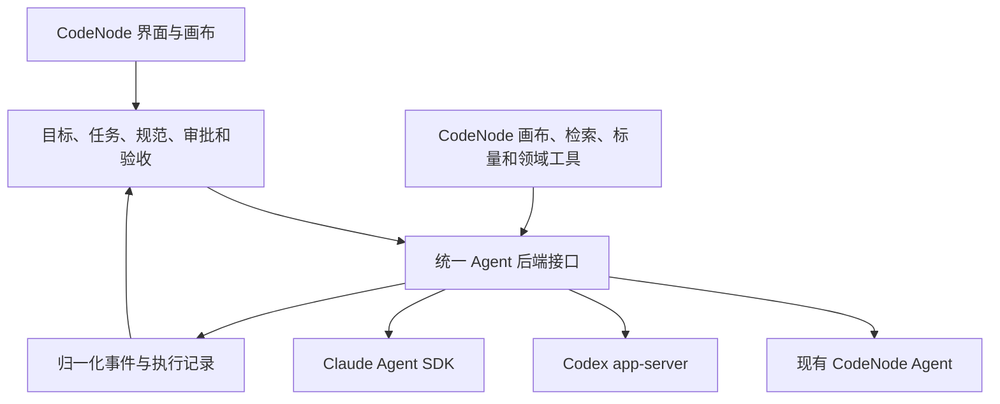

# CodeNode 借鉴建议：长期目标、工程规范与可替换 Agent 后端

日期：2026-10-08

本地参考分支：`yimi-branch`

本地参考提交：`2b5f271`

本文整理 LoopX、Trellis 与成熟 Agent harness 对 CodeNode 的启发，并提出可分阶段验证的演进方案。现状依据本地 README、架构与能力补齐记录，以及 Agent 执行入口的有限检查；本文属于设计建议，不代表完成了全面代码审计、性能对比或接入验证。外部项目及接口能力以所列资料在撰写时的说明为准。

## 1. 建议方向

让 CodeNode 发展为围绕项目、画布和交付结果组织 AI 工作的桌面工作台，并支持可替换的 Agent 执行后端。

优先投入三个方面：

1. 借鉴 **LoopX**：管理跨会话的目标、任务、决定和验收证据，明确什么时候推进、等待或停止。
2. 借鉴 **Trellis**：按任务和角色提供工程规范与上下文，把经过确认的经验沉淀回项目知识。
3. 接入 **成熟 Agent harness**：由 Codex app-server、Claude Agent SDK 等承担其支持的底层执行能力；CodeNode 管理产品交互、领域工具和交付验收。

推荐保留现有自研 Agent，先将它封装为一种后端，再增加外部后端。以真实任务的质量、成本、可控性和维护工作量决定后续默认选择。

## 2. 三个项目的分工启发

| 项目 | 主要关注点 | 值得 CodeNode 吸收的部分 |
| --- | --- | --- |
| CodeNode | 本地项目、对话、可视化工作流、Agent 执行与恢复 | 保留画布、工程容器、领域工具、项目检索和结果核对体验 |
| LoopX | 长期目标跨会话延续，任务归属、决定、证据与运行资格 | Goal 与 Run 分层；持久化阻塞；证据有效性；继续、等待与停止的判断 |
| Trellis | 项目规范、需求澄清、按阶段开发与检查、项目记忆 | 任务 PRD；实现与检查的上下文分离；规范版本管理；经验回写 |

这些能力存在重叠。LoopX 也维护上下文和工作流，Trellis 也持久化任务状态并使用子 Agent。以上描述强调设计重点，不是对能力的排他分类。

Trellis 的 hooks、上下文自动注入和子 Agent 能力因宿主平台而异；LoopX 的持续推进也需要可用的执行主机、运行时与调度机制。引入概念并不自动获得相应运行保证。

## 3. CodeNode 已有基础与复用范围

根据当前项目记录，已有基础包括：

- 单 Agent 运行状态机、取消、失败分类与预算终止。
- Run 事件、检查点、副作用账本和保守恢复。
- 子 Agent 角色、上下文边界、依赖结果确认与工作树隔离。
- Token、重试及费用预算机制。
- 项目检索、结构化记忆、画布执行和工程持久化。
- 工具契约、审批、审计与反馈评测入口。

因此，应先复用现有模块，识别哪些职责与具体执行引擎耦合。

| 现有位置 | 迁移时建议处理 |
| --- | --- |
| `electron/agent.cjs` | 将现有执行循环封装为 builtin 后端，保留其自定义模型支持 |
| `electron/ipc/agent.cjs` | 逐步拆分任务准备、后端调用、事件归一化和结果结算；当前入口同时承担多项职责 |
| `electron/agentState.cjs` | 保留 CodeNode 运行状态语义，显式映射外部后端的状态与终止原因 |
| `electron/runStore.cjs`、`electron/runCheckpoint.cjs` | 保留产品层记录与恢复计划，增加外部会话和执行标识的关联 |
| `electron/subagents.cjs` | 第一阶段沿用现有调度；外部后端内部的子 Agent 单独标记，避免重复调度和记账 |
| `electron/tools/`、检索与标量模块 | 将 CodeNode 专有能力包装成受控工具接口，按后端支持情况开放 |

上述文件位置是实施时的检查入口，不是已经确定的修改清单。不能假设现有权限、成本和恢复保证会自动覆盖外部执行器。

## 4. 借鉴 LoopX：把多次运行连接成同一个目标

### 4.1 建立 Goal → Task → Run → Evidence 的关系

建议在现有 Run 与计划基础上，补足长期目标的稳定身份与生命周期：

| 对象 | 保存内容 | 生命周期 |
| --- | --- | --- |
| Goal | 目标、范围、排除项、验收条件、决定、整体预算 | 可以跨会话、跨天、跨多次执行 |
| Task | 有界工作、依赖、负责执行者、读写范围、验收关联 | 可以经历失败、重试、替代与归档 |
| Run | 某次执行的后端、会话、输入、事件、状态、用量 | 一次具体执行；结束后保留记录 |
| Evidence | 检查方式、结果、来源、时间、版本与适用范围 | 随代码、要求或环境变化而可能失效 |

例如“完成登录模块”是 Goal，“实现接口”和“补测试”是 Task；同一 Task 昨天失败、今天继续会产生不同 Run。Run 的最终答复不直接证明 Goal 已验收。

建议对 Goal 至少持久化以下信息：稳定 ID、目标与范围、验收条件及其修订号、关联任务、待处理决定、下一项可执行工作、停止原因。聊天摘要可以辅助阅读，不能成为这些字段的唯一来源。

### 4.2 让验收证据随版本变化

在已有结构化完成条件与子任务结果确认之上，增加可追溯的证据有效性：

- 记录证据对应哪个验收条件、由谁执行、检查了什么产物。
- 记录代码提交、工作区内容指纹或具体产物指纹，覆盖未提交修改。
- 记录命令、测试结果、环境摘要与执行时间；必要时关联私有完整日志。
- 代码、条件或相关环境改变后，将受影响证据标为需要复核。
- 首版允许保守地扩大失效范围，避免依赖分析不完整时错误保留通过状态。

目标完成应由当前有效证据支持全部必需验收条件，并处理所有阻塞决定。文件被编辑、工具返回成功、Agent 自述完成都不足以单独满足这一条件。

**验收示例：** 测试通过后修改被测实现，界面立即显示相关测试需要重跑；旧测试结果仍可查阅，但不能继续支持当前版本的完成判断。

### 4.3 运行前判断是否存在有效工作

在硬预算之外增加确定性的运行资格判断，综合任务依赖、权限、等待条件、预算和证据有效性：

| 决定 | 条件示例 | 后续行为 |
| --- | --- | --- |
| run | 有依赖已满足且获准执行的任务 | 执行一个有界步骤 |
| needs-user | 缺少必要决定或授权 | 展示具体问题及其影响 |
| wait | CI、实验或外部反馈尚未到达 | 持久化恢复条件与下次检查时间 |
| idle | 暂无有效工作或没有新信息 | 退避，避免重复读取和汇报 |
| stopped | 用户停止或预算不允许继续 | 保留数据并阻止新执行 |
| complete | 当前验收全部通过 | 结束自动推进 |

应先完成判断与写回的幂等性，再增加定时唤醒。重复触发不能创建重复任务或重复副作用；暂停后应阻止后续自动执行。

**验收示例：** CI 尚未完成时只按约定间隔观察；CI 状态变化后再安排验证任务，期间不反复启动完整模型回合。

### 4.4 将业务决定持久化

沿用已有审批与插话能力，增加可恢复的业务决定记录：问题、选项、关联任务、影响范围、决定内容及其修订。

例如“选择 JWT 还是 Session”只阻塞依赖这个决定的工作，其余任务可按边界继续。后续 Agent 能查到决定及理由。审批仍遵循当前权限机制，旧批准令牌不应因恢复而重新有效。

## 5. 借鉴 Trellis：让每次开发获得合适的工程上下文

### 5.1 分开管理规范、任务材料和开发日志

建议区分三类知识：

1. **项目规范**：架构约束、代码风格、测试要求、接口约定，适合版本化评审。
2. **任务材料**：需求、排除项、设计决定、参考文件和验收条件，绑定具体 Task。
3. **执行日志**：发生了什么、遇到哪些问题、交付了什么，关联具体 Run。

优先扩展已有项目记忆与工程存储，避免同一规则在多个目录形成互相矛盾的副本。是否导出成可读文件可由产品需要决定，关键是来源与修改权明确。

### 5.2 根据角色提供上下文

借鉴 Trellis 为实现和检查分别选择材料的方式：

| 角色 | 优先提供的内容 |
| --- | --- |
| 探查 | 问题、目录与符号线索、检索范围 |
| 实现 | PRD、相关规范、设计决定、允许修改的范围 |
| 验证 | 验收条件、测试入口、版本与环境信息 |
| 审查 | 差异、需求、规范、已有证据及其有效性 |
| 画布 | 节点与连接规则、可修改的图范围、图版本 |

提供一份紧凑、可检查的上下文清单，并记录实际使用的来源版本。检索分数只帮助定位；正文是否读取、结论是否被支持仍需单独核对。

### 5.3 用必要的需求澄清支撑实施

在执行复杂任务前形成可审阅的需求与验收条件。仅对影响实现或授权的实质歧义提问；沿用用户已经明确的决定，避免每个阶段机械地重复确认。

### 5.4 将经过确认的经验回写规范

任务结束后生成规范更新建议，例如新发现的架构约束、有效测试方式或已验证的故障模式。保留来源、适用条件和版本，经审阅后再进入共享规范。

临时变通、单次模型猜测和未经复核的子 Agent 结论不直接提升为长期规则。规范更新后，后续任务应能看见变化，旧上下文缓存应能识别失效。

## 6. 接入成熟 Agent harness

### 6.1 推荐架构

图表示拟议职责关系，不代表这些后端已经接入。领域工具需通过相应后端支持的工具协议实际注册和调用。

| CodeNode 管理 | 后端承担其支持的执行职责 |
| --- | --- |
| 目标、任务依赖和跨任务推进 | 单次执行内部的 Agent 循环 |
| 项目知识、画布与领域工具 | 模型调用、工具选择与上下文管理 |
| 用户交互和审批展示 | 对应权限策略的执行与请求反馈 |
| 产品层运行记录与验收 | 后端会话、执行事件和结果 |
| 汇总预算与调度准入 | 可用的执行限制与用量回传 |

### 6.2 第一种外部后端可选 Codex app-server

按 OpenAI 官方文档，app-server 面向深度产品集成，支持会话、流式事件、审批、中断和继续执行。其能力与 CodeNode 的桌面交互需求相匹配，可作为第一种外部后端的候选。

Claude Agent SDK 也是候选，提供 Agent 循环、工具、权限、会话、hooks 和扩展工具能力。第一阶段只接一种后端，避免同时承担多个协议与生命周期的适配成本。

MCP 可用于把 CodeNode 的领域能力提供给 Agent；它本身不替代会话执行与 Agent 循环接口。Codex 的动态工具接口在当前官方文档中标为实验性，采用时应固定兼容版本并做能力探测。

### 6.3 先设计最小接口，再逐步增加能力

建议最小后端接口覆盖：

- `capabilities`：声明实际支持的能力与限制。
- `start`：接受有范围的任务上下文并启动执行。
- `events`：回传文字、工具活动、审批、用量和终态。
- `respondToApproval`：将用户决定返回原执行请求。
- `interrupt`：请求中断，并等待可核实的终态。
- `resume`：使用持久化的后端会话标识继续工作。

插话、自定义工具、子 Agent、细粒度用量及硬预算等能力按支持情况扩展。方法名是 CodeNode 的拟议内部接口，不是外部协议的现成 API。

每次 Run 保存后端名称、协议版本、会话 ID、执行 ID、工作目录、上下文修订与权限配置摘要。后端断线、用户取消、预算触顶、模型失败应分别记录；未知执行结果保留复核状态。

### 6.4 保证边界需要重新接线

| 问题 | 建议 |
| --- | --- |
| 外部后端直接修改文件 | 在其执行边界落实权限并记录版本变化；不能声称旧工具注册表自动拦截了全部写入 |
| 用量仅在执行结束后返回 | 标明只能事后核算；无可靠预留接口时不承诺精确的逐请求硬费用控制 |
| 后端会话可恢复 | 保存精确会话映射；恢复会话与安全重放外部副作用分开判断 |
| 后端断开但进程可能继续执行 | 先核实原执行状态，避免盲目重启同一任务 |
| 宿主内建与 CodeNode 都支持子 Agent | 第一阶段确定一个调度负责人；记录子执行归属，避免重复派发和重复成本结算 |
| 后端协议或工具接口变化 | 版本探测、兼容性检查与显式不可用状态；保留 builtin 后端作为用户可选择的替代 |
| 切换后端 | 传递可审阅的目标和交接材料；不同 harness 的内部会话与检查点不承诺无损互换 |

费用、认证和模型访问按各后端的正式机制接入。接入 harness 不意味着自动获得对应模型权限或订阅额度。

## 7. 产品层优先级

| 优先级 | 建议项 | 首次可交付范围 |
| --- | --- | --- |
| P0 | 统一后端接口 | builtin 行为保持一致，外部后端能力可探测 |
| P0 | 第一种外部后端 | 对话、事件、审批、中断、恢复、差异检查形成闭环 |
| P1 | Goal、Task 与 Run 关联 | 重开软件后可以查看目标、未完成工作和上次结果 |
| P1 | 版本绑定的验收证据 | 相关代码或要求变化后能标记证据失效 |
| P1 | 按角色选择上下文 | 实现、检查使用不同材料，并记录来源修订 |
| P2 | 决定与关注队列 | 首页直接展示需要用户处理的阻塞 |
| P2 | 运行资格与等待调度 | 先保证幂等、暂停和退避，再启用周期唤醒 |
| P2 | 经验回写与后端扩展 | 审核规范更新，依据实测增加第二种后端 |

设置中的后端选择、工作目录策略、预算与调度选项应集中管理并持久化。后端设置需要区分机器默认值与项目覆盖；昼夜主题共用控件和交互，不因切换主题重置执行状态或草稿。

## 8. 分阶段迁移与验收

### 阶段 A：固定基线，封装现有执行器

复用当前离线任务与真实项目样例，记录成功率、人工纠正、执行时长、用量及失败恢复。将现有执行器收进后端接口，首轮保持既有行为。

验收：现有工作流、审批、停止、恢复和模型配置通过原有适用检查；builtin 后端的费用记录不重复。

### 阶段 B：接通一种外部后端

先完成只读任务，再加入有范围的源码修改。CodeNode 展示真实事件，处理后端审批，保存精确会话关联，并核对最终文件差异。

验收：从画布启动任务 → 展示过程 → 用户拒绝一次操作 → 中断 → 恢复 → 检查差异 → 独立执行验收，整条链路可复现。

### 阶段 C：补足长期目标与证据

增加 Goal 关联与紧凑恢复材料，使下一次运行能读到当前要求、有效证据和下一步。

验收：执行到一半关闭应用；重开后能恢复目标，核实原执行状态，识别版本变化，继续合适的任务。旧通过结果不会被误用。

### 阶段 D：增加规范上下文和等待机制

按任务、角色选择规范与资料，持久化用户决定。确认运行资格和停止语义后，加入外部结果观察与退避。

验收：等待期间没有反复执行；条件变化后只推进相关任务；用户停止后不会再自动创建执行。

### 阶段 E：根据实测选择默认策略

在相同任务、起始代码、验收规则和可比预算下，重复比较 builtin 与外部后端。记录 harness、模型、配置和版本；分开解释模型差异与执行机制差异。

优先报告任务通过率、人工介入次数、总用量或可核实费用、耗时、重复操作和恢复成功率。用量不可比或费用未知时明确标注，不用单次演示推导普遍性能结论。

## 9. 首轮实施范围

建议第一轮只交付一个可审阅的切片：

1. 现有执行器的后端封装。
2. 一种外部后端及明确的能力清单。
3. 事件、审批、中断和恢复的统一映射。
4. 一个画布任务到文件差异与独立验收的完整案例。
5. 对权限、成本和副作用恢复实际覆盖范围的记录。

暂缓大规模多后端并行、跨 harness 无损会话迁移和全面自动定时运行。Goal、证据与规范能力按后续切片接入，避免同时改变执行器、调度器和全部存储模型。

核心产品价值应落在：用户能组织复杂工作、看清当前阻塞、检查交付依据，并在中断后可靠地继续。

## 10. 参考资料

### CodeNode 本地设计与现状

- [项目首页](../README.md)

### LoopX

- [项目说明](https://github.com/loopx-project/loopx/blob/main/README.zh-CN.md)
- [架构与长期目标设计](https://github.com/loopx-project/loopx/blob/main/docs/architecture.md)
- [状态、证据、等待与验收概念](https://github.com/loopx-project/loopx/blob/main/docs/development/control-plane-course/00-concept-primer.md)
- [个人工作区指南](https://github.com/loopx-project/loopx/blob/main/docs/guides/personal-workspace-user-guide.md)

### Trellis

- [项目说明与开发工作流](https://github.com/mindfold-ai/Trellis#readme)
- [多平台能力与团队配置](https://docs.trytrellis.app/advanced/multi-platform)
- [安装与首次任务](https://docs.trytrellis.app/start/install-and-first-task)

### 外部 Agent 后端

- [OpenAI 官方：Codex app-server](https://learn.chatgpt.com/docs/app-server)
- [OpenAI 官方：基于 Codex harness 构建产品](https://developers.openai.com/blog/codex-as-a-platform)
- [Anthropic 官方：Claude Agent SDK](https://code.claude.com/docs/en/agent-sdk/overview)

本文记录的是后续演进建议；是否采用某项设计、选择哪个默认后端及扩大哪些权限，应以具体实现与验收结果为依据。

## 11. P0 首轮实施记录（2026-10-08）

后续连接诊断：Windows 手动系统代理未进入子进程的 WebSocket 环境，导致多次重连后才回退 HTTPS。现已继承系统手动代理且尊重显式代理环境；生产代码真实连接检查约 12640 ms 返回 `CODENODE_CONNECTION_OK`，模型为本机配置的 `gpt-6.1-sol`。新增检查只证明推理连接，不代替文件任务验收。文件命令实测暴露 `0.160.0` 原生沙箱初始化错误 `helper_sandbox_lock_failed`，目录为 `.codex/.sandbox-bin`。用户随后明确授权了仅针对该固定目录的临时 ACL 诊断试验；原 ACL 已恢复。重试仍在 `node_repl.exe` 遇到共享冲突（os error 32），之后又出现项目 `.git` ACL 更新拒绝；没有继续修改其它目录 ACL。`0.135.0` 对照能读取并阻止越界写入，但本机网络隔离对照未通过，不能以旧版替代完整验收。P0 保持未完成。

已实现的代码切片：

- `electron/backends/`：统一后端接口、builtin 封装、Codex stdio JSON-RPC、精确线程与执行关联、原执行状态查询、单次审批、中断确认、未知结果守卫和持久化请求去重。
- 兼容本机导出 schema 核对的 Codex `0.135.0` 与桌面运行时 `0.160.0`，其他版本明确报不可用，不静默切换后端。实际记录探测出的版本。
- 对话与画布文件任务共用原 IPC 入口；builtin 沿用原 AbortController、模型、工具、费用和恢复逻辑。外部执行不再调用 builtin 模型或重复记费用。
- 设置提供本机默认／项目覆盖及继承；工作目录固定为项目，默认只读，可显式允许项目文件修改。外部模式显示 Codex 模型入口，不重置原内置模型选择。
- 保存目录、权限摘要、画布修订和文件上下文指纹。外部补丁供审阅，文件内容指纹独立核对；修改代码后执行独立本地校验，校验失败不会放行下游。
- 外部用量按线程累计差额计算，费用未知。外部权限由 Codex 执行边界负责；未声称 CodeNode 工具注册表覆盖全部外部写入，也未承诺硬费用预算或副作用自动回滚。

验证证据与范围：

1. 原离线基线 11/11 通过：127 次真实工具调用、45 个脚本化模型步骤、2475 ms。该评测不代表真实模型成功率；原始 JSON 见 [P0 builtin 基线](eval-reports/p0-builtin-baseline.json)。
2. 全量核心门禁 151/151 通过，最后修正后补跑了静态检查、后端、画布、会话、差异摘要与昼夜 UI 专项。交付检查汇总见 [P0 交付记录](../release/p0-backends-result.json)。
3. `test:backend-workflow` 从真实画布 IPC 进入真实聊天 handler，经独立协议子进程完成一次拒绝、确认中断、持久化恢复、文件差异和独立 Node 测试。协议对端为可复现夹具；这不是实际模型演示。
4. 本机两个原生 Codex 运行时均完成握手、账户探测和线程／执行创建；模型请求持续重连，90 秒内未得到回答，随后均收到确认中断终态，隔离项目文件未改变。隔离测试宿主 API Key 后仍复现。因此真实模型成功执行、实际模型下的审批与恢复完整案例、实际沙箱边界仍待进一步验收，**P0 尚未标记全部完成**。
5. 暂存包与固定交付包均须通过自检，打包后设置在昼夜两种主题中共用结构和交互，并验证会话、草稿、内置模型选择与侧栏状态保留。新增 backend 模块、配置和构建输出逐文件与 asar 比对。

交付默认继续使用 builtin；Codex 为显式可选后端。认证仍由本机 Codex 管理，CodeNode 不复制账户凭据。首版未接入 CodeNode 的画布修改工具、子 Agent、图片及 `/compact`；这些能力仍使用 builtin。本文档现纳入项目版本控制并随源码同步；首版限制是历史状态，后续 Agent 接入见第 12 节。

## 12. 主流 Agent 接入与 Goal 运行门禁（2026-10-09）

> 以下为阶段记录；当前接入方式以本文末“统一 ACP 与 BackendPort 迁移”及 README 为准，旧 app-server/SDK 的实测证据不代表新版 ACP 已实测。

### 外部 Agent 覆盖

设置中的可选后端现为 CodeNode 内置、Codex app-server、DeepSeek Harness、Hermes Agent、OpenCode、OpenClaw。这里的接入目标是用户已安装的本机 Agent：CodeNode 不下载或安装它们；默认命令从 PATH/Windows npm global 解析，也可填写已有 executable 路径，并通过该 Agent 自己的配置、登录和环境变量运行。设置保存为本机默认或项目覆盖；DeepSeek Harness 另需指向已存在的 `DSH_HOME` profile。点“检测当前配置”会验证当前未保存的命令和参数，并执行协议初始化握手；检测不写入设置，也不发送模型 prompt；握手通过只证明连接可用，不等于代码任务闭环。Hermes、OpenCode、OpenClaw 使用 ACP v1 stdio；DeepSeek Harness 使用其官方 SDK JSON-RPC profile。外部 Run 在原项目目录执行，CodeNode 记录运行前后差异和会话恢复信息。

ACP 权限请求不采信 Agent 自报的工具类别作为授权依据。只读策略拒绝所有权限请求；项目写入策略对请求逐次展示并询问用户。ACP 桥不构成操作系统沙箱，所以文件范围或权限请求不能代替子进程级隔离。DeepSeek SDK 协议没有逐会话取消或审批请求；CodeNode 为每个执行使用专属 runtime，停止会请求关闭该 runtime。SDK profile 和 `$DSH_HOME` 承担它自己的工具、凭据、权限与持久化设置。

真实本机连接检查：CodeNode ACP adapter 直接从当前 PATH 启动已下载的 Hermes `0.20.0`、OpenCode `1.17.18`，两者 initialize 握手成功并声明会话恢复能力；检查只建立协议会话，没有发送模型 prompt。OpenCode 另有真实临时源码任务通过独立测试的记录。Hermes 的隔离源码任务以 `HERMES_SAFE_MODE=1` 再测，收到一次 DeepSeek API 响应后卡在 `Creating new local environment for task default...`，75.6 秒后以 `backend_result_unknown` 结束，无工具调用、无文件变化，临时工程已清理；此前非 safe mode 的失败还出现了缺失 shell hook。现象与[Hermes 报告的 Windows ACP/Git Bash 工具初始化挂起](https://github.com/NousResearch/hermes-agent/issues/73693)相似，但尚未证明同因。OpenClaw 已安装的全局 `2026.2.2-3` 在 `--version` 阶段即因缺少 `undici/lib/cache/memory-cache-store` 退出；CodeNode ACP initialize-only 检查未到 Gateway，也没有 prompt。此前仓库临时安装同版并用临时 Gateway 验证了 session 创建/取消，但不能证明本机全局安装可用。DeepSeek Harness 此前在隔离 Python 3.11 venv 与 `DSH_HOME` 下完成 SDK handshake 和一次无工具文本请求；当前系统 PATH 没有 `dsh`，环境也未提供 `DEEPSEEK_API_KEY`，故本轮没有重跑模型请求。所有 CLI/runtime 安装仍由用户管理，CodeNode 只连接现有命令和配置。

### Goal、Task 与证据

项目 Goal 状态、停止原因、验收条件版本、Task 依赖与读写范围、业务决定版本、等待观察、项目上下文、预算、run admission/settlement 及证据均持久化在项目 `.codenode/goals.json`。应用重启后 Goal IPC 列表会运行真实 RunStore 中断扫描和 admission 对账；遗留 Run 进入 `interrupted`，对应 Task 进入结果未知/阻塞；用户查看运行记录和项目差异后才能重新排队。重复结算、相同决定、经验确认或相同等待观察不增加状态修订。

显式选择 Task 的聊天请求会先检查 Goal 状态、预算、决定、依赖和活动 Run，再作原子 admission。结束时结算可读 token 和可靠的内置费用；费用未知时如实记录，若 Goal 设有美元上限，则在未知费用得到处理前暂停新 admission。执行结束不等于验收通过：Task 完成要求当前文件指纹、运行环境和当前验收条件版本对应的通过证据。验收命令在运行前逐次确认，运行期间若改动项目文件，则结果记为失败。证据后项目文件、环境或验收条件版本变化、扫描不完整或校验失败都会阻止 Goal 完成；旧证据不会自动覆盖新状态。

Goal/Task 表单保存目标、排除项、必需验收条件、预算、依赖和读取/写入范围。Task 可声明读取与写入范围。当前写入范围在执行后比较文件差异，越界或无法完整读取项目快照会把 Task run 标为失败，文件保留供审阅；这不是执行前的硬沙箱，也不代表读取范围已由操作系统强制限制。用户未声明写入范围时不会声称进行了范围限制。

按角色生成的上下文用于主 Agent 和子 Agent：探查角色只收项目规范；实现角色收规范、任务材料与经用户确认的经验；验证和审查角色收规范及任务材料；画布角色收规范和任务材料，并将上下文修订写入 Run。新经验先以候选保存，只有用户显式确认后才对实现角色可见；通过独立检查的 Run 可生成有限的测试方法候选，更广泛的架构经验仍需用户整理。待处理业务决定、阻塞/未知 Task 和费用预算待复核项汇入跨 Goal 侧栏队列。time wait 到期后应用定时刷新，GitHub Actions 与 Agent Eval 按退避时间只读轮询，并只释放匹配的 Task。自动推进默认关闭；用户在 Goal 面板授权后，条件匹配才会尝试启动该 Task，且受每个 Goal 的次数上限、依赖、决定、运行状态和预算约束。未授权时由用户手动发起下一步。

### 本轮验证与边界

协议夹具测试覆盖 ACP 初始化/会话/权限拒绝/授权与 DeepSeek SDK 的 initialize、prompt、assistant、tool/call、tool/result、终态通知。Goal 单测覆盖预算与准入、活动 Run、依赖循环、等待条件、业务决定、按角色筛选上下文、验收证据、文件快照失效、条件修订、声明写入范围，以及未知 Run 的复核绑定、直接状态/等待/决定绕过拒绝和复核后指纹失效。Electron UI 验证了 Goal 控件和后端控件在日夜主题结构一致，且主题切换保留会话、草稿、模型和侧栏状态。

本轮 `npm run verify` 的构建、脚本检查和核心测试全部通过（157/157）；最后的 Goal UI 文案调整后再次通过 `npm run build` 与 `npm run test:backend-ui`。`npm run test:goal-desktop-restart` 的双 Electron 进程复核/重排演练，以及 Agent Eval provider/IPC/报告绑定专项也已通过。最新固定交付路径 `E:\CodeNode\release\win-unpacked` 的 packaged UI 自检为 18/18，实际 asar main/preload 启动检查通过；`app.asar` SHA-256 为 `C481973BF18AB0301A024493B811FA573D64E8CBC17B138B624F64051B293549`。本机 `rcedit` 无法写回 exe 元数据，因此构建时关闭该编辑步骤，保留替换前固定包的 `CodeNode.exe`（SHA-256 `4E069955705384D0B711BEDF5611B7C0BC91FF8C84FC199879D29FC4910F9BAB`）；该 exe 的资源元数据为 Electron 44.4.1，固定启动文件名不变，应用版本和新功能由 app.asar 提供；exe 未签名。

| 路线项 | 当前覆盖 | 尚需的证据 |
| --- | --- | --- |
| P0 后端与设置 | builtin、Codex、DeepSeek Harness、Hermes、OpenCode、OpenClaw 可选；ACP/SDK fixture、Hermes/OpenCode/DeepSeek 短文本请求、OpenClaw 临时 Gateway session、OpenCode 临时源码修改及权限拒绝/取消/恢复、打包自检通过 | Codex 原生 sandbox 故障；Hermes 文件工具初始化错误；OpenClaw 全局安装及真实模型/文件任务/权限闭环；DeepSeek 源码任务与逐会话取消/权限闭环；实际 OS 沙箱边界 |
| P1 Goal/Task/Evidence | 持久化、准入、预算、决定版本、环境/文件/验收版本绑定证据、重启未知状态已实现；`npm run test:goal-desktop-restart` 通过两个 Electron 主进程完成重启后的 Run 复核与 UI 重排；直接 IPC、`ready` 状态、定时等待和未解决业务决定都不能绕过未知 Run 复核；项目指纹变化会使复核失效 | 该 E2E 操作项已完成。RunStore 保存文件路径和前后 SHA-256，不保存旧源码正文；界面如实标注这一点并提供打开当前文件入口，外部副作用仍需用户核对 |
| P1 角色上下文 | 主 Agent 与五类子 Agent 都按角色筛选规范/材料/确认经验，实际子代理提示注入已测试，Run 记录上下文版本 | 真实模型角色任务与人工质量比较 |
| P2 决定队列与等待 | 跨 Goal 队列、幂等决策、时间等待释放、指数退避已实现；GitHub Actions 按精确 SHA 查询，Agent Eval 按精确 SHA/数据集/模式读取本地完成报告；Goal 刷新按退避时间只读轮询这两个 provider，匹配后只释放对应 Task；自动推进默认关闭，需在 Goal 面板明确授权，每个 Goal 最多自动尝试 3 次，且仍检查 Goal 状态、依赖、决定、unknown Run 与预算；每次等待释放只产生一次认领，失败、重启前未 admission 或 unknown Run 都不自动重试 | 外部 LoopX/远程实验跟踪未接入；真实模型多轮闭环仍需实测 |
| P2 经验回写 | 基于新鲜、独立通过的测试证据自动生成局部测试方法候选；记录来源 Run、Task、证据 ID、文件指纹和验收修订；UI 标明自动建议；重复结算幂等；未确认前不注入实现上下文，用户显式确认后才可用 | 当前自动建议限于“修改这些文件后运行该测试命令”的可验证事实；从模型总结、架构规律或重复故障中提炼更一般经验尚未实现 |
| 阶段 E 后端比较 | 有离线 fixture、Hermes/OpenCode 文本 smoke 与一次 OpenCode 文件任务（Hermes 文件任务在本机 runtime 报 Internal error，未改文件） | 同任务多轮、相同验收标准下的成功率/用量/成本/恢复率比较未完成 |

等待自动推进现在由项目 Goal 持久化授权控制，默认关闭；时间等待与 GitHub Actions、Agent Eval 会按下次检查时间和指数退避唤醒，未满足条件期间只做只读观察，不启动模型。匹配后只为对应 Task 生成一次性认领；主进程再次检查授权、Goal active 状态、依赖、决定、预算及 unknown Run，每个 Goal 最多自动尝试 3 次。失败、未 admission 的重启恢复和 unknown Run 都不会自动重试。`test:goal-store` 与 `test:goal-ipc-recovery` 覆盖状态机、外部轮询、重复认领、暂停/预算门禁、授权撤销和失败后不重试；桌面 UI 测试覆盖默认关闭、授权持久化及双主题状态一致。时间等待释放后的真实模型自动启动闭环已于 2026-10-09 通过桌面验收，见下方补充记录。

### 2026-10-09 ACP 权限、取消与恢复实测补充

OpenCode 最新 ACP 说明确认其支持 `session/cancel`、恢复会话、权限请求及拒绝待处理权限。新增 `npm run test:backend-live-acp-lifecycle`，在仓库外的临时工作区使用项目级 OpenCode 配置 `bash: ask`，实测 CodeNode 拒绝一次 bash 请求、没有文件变化；首个文本块后取消得到 `CANCELLED`；随后用精确会话 ID 恢复并返回哨兵。脚本只删除本次创建的 OpenCode 会话并清理临时工作区，不更改用户全局配置。此证据覆盖 OpenCode 的权限拒绝、取消和恢复协议路径；不代表它默认会询问命令，OpenCode 官方默认策略是允许操作，也不构成操作系统沙箱。

DeepSeek 补充实测使用独立 venv 与临时 `DSH_HOME`，CodeNode SDK adapter 初始化后完成一次真实文本推理，未请求工具且工作区指纹不变。新增 `npm run test:backend-live-deepseek`，只在调用者已经安装 SDK/runtime 并通过环境提供 API key 时运行；不保存 API key、不自动安装 runtime。DeepSeek SDK profile 的工具权限由 Harness 管理，当前协议无逐会话审批接口；本次文本 smoke 不构成源码写入或沙箱验收。

OpenClaw 兼容实测使用 npm 隔离安装的 Node 兼容版本 `2026.2.2-3` 和临时 Gateway/state/config/token。CodeNode 通过 ACP 创建 Gateway session，然后在 `session/prompt` 前取消；工作区没有变化，也没有 API prompt。该旧版要求 `session/new` 带 `mcpServers: []`，而当前官方 ACP 文档要求客户端省略该字段；adapter 只在服务端明确返回“期望数组、收到 undefined”的 `-32602` 错误时回退加空数组，避免破坏新版。新增 `npm run test:backend-live-openclaw` 可用 `CODENODE_OPENCLAW_BIN` 指向已安装 CLI 后重跑。全局 OpenClaw 安装依然缺少 `undici` 文件，未被替换；本次临时 Gateway 和安装目录均已清理。

Goal 等待机制新增只读 GitHub Actions provider：根据项目 `origin` 仅接受 `github.com`，以显式完整 commit SHA 或当前 `HEAD` 请求 workflow-runs REST API，忽略其他 SHA，并按每个 workflow 的最新 attempt 汇总；只有所有匹配 workflow 均完成且结论为 success 才把对应 Task 释放为 ready。未完成/失败状态会写入带 SHA、run ID 和 GitHub 详情 URL 的观察记录并使用现有指数退避；下次检查时间未到时 IPC 会拒绝重复查询。私有仓库可用进程环境中的 `GH_TOKEN` 或 `GITHUB_TOKEN`，token 不落盘。该 provider 不创建模型 Run。[GitHub Actions workflow-runs REST API](https://docs.github.com/en/rest/actions/workflow-runs#list-workflow-runs-for-a-repository) 是状态来源。

新增 `npm run test:goal-github-actions` 用固定 API 响应验证 repository/commit 过滤、workflow attempt 汇总、鉴权头、失败和退避；`goal:wait-check` IPC 另以注入的 fetch fixture 走完任务释放。Goal 面板允许用户选择 GitHub Actions、可选填写完整 commit SHA、查看最近状态；首查默认 HEAD。实时检查使用 Electron `net.fetch`，并验证全局 Git 配置不会被修改。

新增 Agent Eval 报告等待源：只读项目 `docs/eval-reports/agent-eval-*.json`，按完整 commit SHA、数据集版本和 `model`/`offline` 模式精确匹配，并忽略等待条件创建前的旧报告。成功要求报告绑定同一 clean commit、退出码为 0、所有必需任务通过且评测自身检查全通过；部分子集、坏报告、脏工作树或失败报告都不会释放 Task。Goal 面板保存这些匹配条件并展示必需任务通过数与报告名，用户手动查询；provider 不运行评测、不发起模型请求。`npm run test:agent-eval-wait` 和 `test:goal-ipc-recovery` 覆盖报告匹配、过期/失败状态及 IPC 释放。`agent-eval.cjs` 的 Git 读取使用仅限当前仓库的命令级 `safe.directory`，不改全局 Git 配置；`test:real-model-pr` 验证报告 fullCommit 与 HEAD 完全一致。

Electron `net.fetch` 对远端 commit `fda3239` 的只读探测返回两个 workflow failure，证明 provider 能读取真实外部状态；失败不会释放 Task。远端日志随后定位到 macOS `workflow-state` 测试把真实路径别名误判为越界、Linux smoke 仍查找旧 `.side-badge` 选择器；这两项已修正。commit `060f3df` 的 CI 中 Ubuntu 与 Windows 通过；macOS 两项后端测试超时。commit `f24289b` 修正取消竞态后，macOS 已能完成中断，但恢复文件任务仍在确认前被边界拒绝，独立代码校验因此为空。日志显示没有进入 `tools:confirm`；结合 `resolveInRoot` 先比较绝对路径前缀再做 realpath，最终定位到 `os.tmpdir()` 与子进程 `cwd` 在 macOS 上使用了不同临时目录别名。两项测试现将临时项目根规范为 `fs.realpathSync` 后的真实路径；工作流用例也会在加载确认桥前移除继承的自动应答测试模式。本机后端专项与 `npm run check:js` 通过；commit `43bee0b` 的 CodeNode CI（run `37852323277`）中 Ubuntu、Windows、macOS 验证及三平台打包全部通过，同次推送的 production-gate（run `37852323397`）也通过。

Goal settlement 现会在 Run 完成、当前 Task 仍有有效证据且 CodeNode 局部测试命令通过后，自动生成一条经验候选。候选包含准确的测试命令、相关文件、Run/Task ID、证据 ID、文件指纹和验收条件修订；重复结算不会重复生成。失败、仅语法检查、过期指纹或不完整快照都不生成候选。Goal 面板显示“自动建议”，但候选仍是待复核状态；只有用户点选确认后，后续实现上下文才会包含它。该生成器先覆盖可验证的测试方法，不从单次模型回答推断架构规则或反复故障模式。

`npm run test:goal-desktop-restart` 现用两个独立 Electron 主进程覆盖完整复核操作：第一进程写入活动 Goal Run 后关闭；第二进程通过真实 `goal:list` IPC 恢复为 unknown/blocked，在 Agent 侧栏显示该 Run 持久化的文件路径与前后 SHA-256。E2E 验证直接调用 `goal:task-update`、改为 `ready`、设置定时等待或解决业务决定都不能绕过复核；随后在界面展开差异、勾选“我已查看 Run 差异并核对外部副作用”，确认后才把 Task 重新排队并重新获得 `canRun=run`。复核记录绑定 Run ID 与当前项目文件指纹，复核后文件变化会拒绝重排并要求重新查看。`npm run test:backend-ui` 另验证复核明细控件在日/夜主题下结构一致，同时会话、草稿、模型和侧栏状态保持不变。当前 RunStore 保存的是文件路径和指纹摘要，不保存旧源码正文；界面明确说明该边界并提供打开当前文件入口。测试使用独立临时 User Data 与项目目录，结束后清理。

Hermes v0.20.0 在 `HERMES_SAFE_MODE=1` 下的短文本 ACP 请求通过，说明禁用用户自定义配置后推理链路仍可用；但同一安全模式下的隔离源码任务仍在 DeepSeek API 返回后卡于 `Creating new local environment for task default...`，约 75 秒后 `session/prompt` 超时，无工具调用、无文件变化。该运行不再出现用户配置中的缺失 shell hook，说明 hook 不是唯一故障原因。[Hermes 上游 Windows ACP 问题](https://github.com/NousResearch/hermes-agent/issues/73693)仍报告本地文件操作触发 Git Bash 快照初始化挂起及取消错误，并标注其底层 MSYS 原因尚未证明；本机结果与其症状一致，但不据此声称已经定位或修复。

本机 `node` 为 24.11.0，系统 OpenClaw `2026.2.2-3` 仍因缺少 `undici/lib/cache/memory-cache-store` 无法启动。此前隔离安装同版后用临时 Gateway 验证 ACP `session/new`，没有发 prompt。2026-10-09 重跑 `npm run test:backend-live-openclaw` 时，失败于启动 Gateway 之前的全局 `openclaw --version`，仍是同一个缺失模块；没有模型请求，脚本清理了临时目录。尝试安装最新 OpenClaw 时，其包要求 Node `>=24.16.0 <25` 或 `>=26.1.0`，npm tarball 校验不稳定；全局安装、Node 和用户配置没有改动，默认 OpenClaw 配置的修改时间仍为 2026-02-04，测试进程均已退出。DeepSeek SDK/runtime `0.1.5rc1` 的隔离文本推理也通过，`npm run test:backend-live-deepseek` 提供复现命令；本机当前没有 `dsh` runtime 或 `DEEPSEEK_API_KEY` 环境变量，因此没有重跑真实请求。两者仍缺少真实源码任务证据。

协议请求和恢复能工作不等于权限已在操作系统边界执行。ACP Agent 可以使用其自身配置允许的文件/命令工具；DeepSeek SDK profile 也由 Harness profile 管理权限。本项目的变更指纹和写入范围检查发生在执行后，不能阻止越界副作用。Codex 本机 `helper_sandbox_lock_failed` 尚未排除，期间未继续修改 ACL。P0 仍缺稳定的执行隔离及 Hermes、DeepSeek Harness、OpenClaw 的真实源码任务、权限及中断恢复验收。P2 等待周期已实现为默认关闭且需 Goal 级授权，状态/预算/未知 Run 门禁和专项测试通过；授权后的时间等待真实模型自动启动闭环已通过桌面验收；外部等待 provider 的真实多轮闭环仍未覆盖。外部 LoopX/远程实验跟踪和阶段 E 的重复实测比较仍未完成，因此本目标不能标记为全部完成。

### 2026-10-09 本机 Agent 接口修复

用户明确本轮只要求连接已有 Agent 的接口，不要求在此机下载、安装或修复第三方 runtime；协议 fixture 是接口的自动化验收，历史真实运行结果作为可选环境诊断保留。本轮修复：连接检测接受当前未保存配置，经同一设置校验器验证后只做能力握手；保存设置仍由保存按钮单独完成；保存/继承后同步启动参数草稿，防止检测误用前一个 profile 的参数。Hermes、OpenCode、OpenClaw 的 ACP 权限选择控件已从错误的 Codex/DeepSeek 条件内移出，三种后端均可配置只读或逐次审批。DeepSeek adapter 每轮清空旧错误/receipt，并在 initialize 后检查取消信号，取消时不发送 session/prompt；ACP adapter 新轮重置 session ID，避免连接失败继承旧会话而被误标为执行结果未知。真实协议进程夹具和 UI 测试覆盖未保存配置不落盘、敏感参数提前拒绝、失败后复用成功、初始化后取消零 prompt 及双主题 ACP 控件状态。用户已有 CLI 的安装、更新、凭据和内部运行环境由用户管理，CodeNode 本轮不下载或修复它们。本轮完整 verify 157/157、源码设置 UI 与包内设置 UI 的未保存检测/权限控件/双主题测试均通过；固定交付包 18/18 自检和正式 asar 启动通过。

### 2026-10-09 Codex Windows sandbox 只读诊断

默认 `CODEX_HOME` 的只读配置显示 `[windows] sandbox = "elevated"`。最新 `.sandbox/setup_error.json` 与 sandbox 日志均报 `helper_sandbox_lock_failed`，消息指向无法打开 `%USERPROFILE%\.codex\.sandbox-bin` 目录；该目录当前没有 reparse 属性，当前用户 ACL 有 Modify，PowerShell/Node 也能枚举目录，因此现有证据不像普通的目录读取权限拒绝，但仍不能区分并发占用、runner 内部锁问题或其他 Windows 句柄状态。没有修改 ACL 或 Codex 配置。本机 PATH 上的 `codex --version` 为 `0.135.0`，缓存的 `codex-command-runner` 是 `0.160.0`。桌面更新检查报告 `restart_required`，检查本身未重启或切换运行时。官方 [Windows sandbox 文档](https://learn.chatgpt.com/docs/windows/windows-sandbox)目前介绍了兼容设备上的 MXC，以及 `elevated` / `unelevated` legacy fallback；standalone CLI 的 `prefer_mxc` 需要 `0.162.0`，桌面 app 则由 rollout 配置控制。当前未证明这台机器的 Codex 桌面版本、MXC 兼容性或 rollout 状态，故未切换实现；故障仍未解决。

### 2026-10-09 授权后的真实模型自动推进验收

新增显式运行入口 `npm run test:goal-auto-live`，使用本机已安装的 OpenCode 1.17.18 和既有认证，在独立临时项目、User Data、Home 与 Soul 中运行三个 Electron 主进程。它通过实际 Goal 授权控件、时间等待调度器、应用级自动推进组件、preload 与 `agent:chat` IPC 发起真实 ACP 模型请求，不直接调用聊天启动来代替自动调度，不安装第三方 Agent。临时项目拒绝模型工具操作；结束后删除本轮创建的 OpenCode session 和临时工程。

源码版及暂存交付包均通过以下验收：

- 未授权时，时间等待到期只释放 Task，不产生 Run 或模型请求；点击 Goal 中的授权控件后，真实模型返回本轮新生成的哨兵，Run 恰好结算一次为 completed。
- 成功和故意设置不存在的 executable 所产生的失败路径，各在认领 IPC 返回前刷新 Goal 三次，共六次；刷新不丢失认领。启动失败产生一个 failed Run，反复刷新及重启均不自动重试。
- 成功回复只证明执行结束，没有独立验收证据的 Task 仍为 blocked，不把模型回答自动判作业务验收通过。
- 真实 claim IPC 已完成但尚未 dispatch 时退出应用；下一进程恢复为 failed（app_restarted_before_admission），不重放启动。
- 另一个授权 Task 自动启动真实模型，在收到首个正文块时强制结束本轮 Agent 子进程及主进程；第三个 Electron 进程恢复该 Run 为 interrupted，Task 为 unknown/blocked，拒绝运行并要求复核，不自动重试。

验收发现并修复了刷新竞态：原自动推进 effect 每次因 Goal 列表更新而清理时都会设置 cancelled，导致同一项目的有效认领被误标记为 project_changed_before_dispatch。现在只在组件卸载或项目代际改变时取消待启动认领，普通 Goal 刷新不取消。构建、JavaScript 检查、Goal store/IPC 专项及源码和包内双主题 UI 均通过；双主题保持会话、草稿、模型和侧栏状态。暂存包 UI 自检 19/19 和实际 asar 启动自检通过。

可复现命令：`npm run build` 后运行 `npm run test:goal-auto-live`。设置 `CODENODE_AUTO_LIVE_PACKAGE` 为 unpacked 包目录可验收其实际 app.asar main/preload/renderer；`CODENODE_AUTO_LIVE_REPORT` 可指定 JSON 报告。此入口会实际使用已登录 OpenCode 发起模型请求，故不加入默认离线测试套件。原始打包验收摘要及脚本、组件和 asar 的 SHA-256 保存于 [验收证据](validation/goal-auto-advance-live-2026-10-09.json)。报告中的 recordedAt 使用 UTC。

范围：本次验证 Windows 桌面上的 OpenCode、时间等待以及文本任务自动推进；不代表所有外部 Agent、GitHub Actions/Agent Eval 外部状态真实闭环、美元预算或操作系统隔离均已实测，也不替代具体业务 Task 的独立验收。其余角色质量比较、阶段 E、外部实验跟踪和一般经验提炼保持原状态。

交付已覆盖固定目录 `E:\CodeNode\release\win-unpacked`，覆盖前确认 CodeNode 未运行；固定包与实测暂存包 app.asar SHA-256 均为 `B2FCA2BD28D8B2710CE9F0FC3BB3ACF8C72EB96BC8F1B52B03896C3A23C5F046`，`CodeNode.exe` SHA-256 为 `4E069955705384D0B711BEDF5611B7C0BC91FF8C84FC199879D29FC4910F9BAB`。覆盖后 19/19 UI 自检与实际 asar 启动自检通过；打包配置仅含公开 Agent 模板和已提交 Soul，保留本地私有配置及用户 Soul 修改。

### 2026-10-09 统一 ACP 与 BackendPort 迁移

按用户要求参考 QwenAudio/qwen-audio-agent 的协议中立 [BackendPort 契约](https://github.com/QwenAudio/qwen-audio-agent/blob/main/server/src/backend/backend-port.mjs) 与 [ACP 接入说明](https://github.com/QwenAudio/qwen-audio-agent/blob/main/docs/backends/overview.md)，将现有外部调用链统一为 ACP v1 stdio。Codex 改用已安装 codex-acp，DeepSeek 改用 dsh --profile acp；Hermes/OpenCode/OpenClaw 共用同一 ACP 客户端，增加自定义 ACP 命令入口。旧专用协议实现及夹具已移除，配置、检测、管理、聊天、画布工作流、取消和精确会话恢复一起迁移。

统一接口包含 describe/start/health/submit/status/cancel/respondAuthorization/respondInput/subscribe/close。start/health 只握手、不推理；submit 产生 owner 范围内的 Task，状态与审批/输入回复严格绑定 Task/owner，一次授权不扩大到以后任务。事件按消息、活动、权限、输入和产物分类，保留现有渲染桥接；请求编号不能覆盖聊天 requestId。关闭时释放待处理请求与专属协议进程；共享/隔离会话、重复提交、跨工程复用及旧协议恢复均有明确门禁。

内置执行器也走 BackendPort，内部保留本机模型循环；Goal、独立验收和文件范围逻辑未移到模型侧。旧默认 Codex CLI 配置和 DeepSeek sdk 参数迁移到 ACP 启动入口，设置保存为版本 2；旧线程/SDK 会话只可查看历史，必须复核后新建 ACP 会话。ACP 的 max_tokens 不再记作完成。所有外部后端共用同一组日夜主题控件和持久化设置，原生 CLI、登录配置及缺失依赖不由 CodeNode 自动安装。

测试新增 test:backend-port，并纳入默认离线套件；真实 stdin/stdout 夹具覆盖初始化幂等、Task 生命周期、owner 边界、权限/输入、取消、共享/隔离会话、事件、重复/关闭门禁、旧配置迁移和旧记录拒绝重放。现有文件任务的权限拒绝、中断恢复、指纹、独立校验和画布工作流测试已切换为 ACP。OpenCode 真实模型自动推进、失败和重启路径通过；本机 codex-acp/dsh 不在可解析命令中，未下载第三方 Agent，不声称这两条模型请求实测通过。

本轮完整构建、脚本检查与核心回归 159/159 通过；后续取消统一转发、预取消和纯 ACP 夹具清理又通过 BackendPort／后端／状态机／多后端专项与静态检查。源码与最终包内设置 UI 在日夜主题下共用结构、功能和配置，切换保留会话、草稿、模型及侧栏状态。最终包 UI 自检 19/19、实际 asar main/preload/renderer 启动检查通过。最终包通过 OpenCode 1.17.18 的真实自动推进、失败不重试、启动前遗留认领恢复，以及推理中断后的三进程重启复核；报告直接从被验收的 asar 提取 BackendPort 和配置哈希，保存于 [新版 ACP 实测证据](validation/acp-backend-port-live-2026-10-09.json)。

固定交付路径 E:\CodeNode\release\win-unpacked 已更新；覆盖前确认 CodeNode 未运行，不保留旧包备份。app.asar SHA-256 为 B36CABFD71D723E277BB66869ADDF89FBA23F87B17FA24C0A49827E1FC6AA548；CodeNode.exe SHA-256 为 4E069955705384D0B711BEDF5611B7C0BC91FF8C84FC199879D29FC4910F9BAB。覆盖后 19/19 自检与实际启动检查再次通过。只把公开 Agent 模板和已提交 Soul 放入交付包，本机私有配置及未提交 Soul 修改保留。
### 2026-10-09 对话栏顶部 Agent 快捷切换

对话栏顶部新增 Agent 下拉入口，不占用输入框控件行、不增加第二个对话关闭按钮。点击展开列表，选择只预览，必须点击“确认切换”才保存。有历史对话时明确显示“新建对话并切换”，保留原会话及输入草稿；运行和切换期间禁用入口，并阻止新发送和自动推进竞态。高级连接设置仍集中在设置 → 常规 → Agent 后端。

连接配置按 Agent 分别保存在既有 backend.json 的 profiles 中，兼容旧单配置格式；快捷切换有项目时仅覆盖当前项目，无项目时保存本机默认。切回已有 Agent 恢复其命令、参数、模型和 ACP 配置。会话配置查询可带当前 session ID，恢复旧 ACP 会话时顶部与输入区显示该会话实际绑定的 Agent，而非误显示项目默认值。

新增 test:agent-switch-ui，已纳入显示环境测试组。源码与最终包内 UI 验证了两步确认、Escape 取消、已保存配置恢复、原历史和草稿保留、运行禁用、自定义 ACP 未配置时阻止切换、高级设置跳转，以及双主题相同结构/状态。图片来自实际暂存包界面：[日间效果](validation/agent-switcher-preview/light.png)、[夜间效果](validation/agent-switcher-preview/dark.png)。构建、脚本检查、后端与画布工作流专项、既有后端设置双主题检查通过；暂存和固定交付包 UI 自检 19/19、实际 asar 启动自检通过。

已覆盖 E:\CodeNode\release\win-unpacked，覆盖前确认 CodeNode 未运行，不保留旧包备份。app.asar SHA-256：8BF65362B3362721B5F94DF1B8985DC61AC6A8FB8D41AFF7175A9BB00E51F1F5；CodeNode.exe SHA-256：4E069955705384D0B711BEDF5611B7C0BC91FF8C84FC199879D29FC4910F9BAB。打包仅包含公开 Agent 配置模板和已提交 Soul，本机私有配置和用户未提交 Soul 修改保留。
### 2026-10-09 参考 LoopX 的紧凑 Agent 选择器

依据用户提供的 LoopX 截图，将入口改为机器人图标 + Chat + 当前 Agent 简称，菜单收窄为 218px，使用单行名称和当前使用的勾选标记。取消常驻的双行介绍及大块说明区，只有选择其他可用 Agent 时才展开切换确认；运行禁用、原对话/草稿保留和各 Agent 配置恢复规则继续生效。菜单底部保留连接设置入口，日夜主题只由同一组配色变量表达。

新增只读本机启动命令探测，直接按已保存的命令/路径或默认命令做文件解析，不启动 CLI、不发模型请求、不自动安装。找不到命令或自定义 ACP 尚未配置时，菜单置灰并标注“不可用”，键盘导航跳过这些项。命令存在仅表示已找到启动入口，不代表认证、Gateway、依赖或模型请求已通过，完整连接仍使用设置中的检测。

构建、脚本检查、后端专项、原后端设置双主题测试和源码/包内 Agent 选择 UI 测试通过；验证了当前勾选、候选预览不保存、不可用禁用、确认切换、Escape、历史与草稿保留及双主题同结构。最新效果图仍在 [日间](validation/agent-switcher-preview/light.png) 和 [夜间](validation/agent-switcher-preview/dark.png)。暂存与固定路径均通过 UI 自检 19/19 及正式 asar 启动检查。

已覆盖 E:\CodeNode\release\win-unpacked，覆盖前确认 CodeNode 未运行。app.asar SHA-256：AD99350593F367238B1EE2B14914528172020C18741358550A8CC6E4BBCDDB45；CodeNode.exe SHA-256：4E069955705384D0B711BEDF5611B7C0BC91FF8C84FC199879D29FC4910F9BAB。使用公开 Agent 模板及已提交 Soul 打包，用户私有配置及未提交 Soul 修改保留。

### 2026-10-09 自研 Agent 统一命名为 CodeNode

内置自研 Agent 的显示名称在 config/agent.backends.json 集中改为 CodeNode，顶部显示 Chat CodeNode，菜单、设置选项、检测反馈与切换提示同步；内部 builtin 标识和直接模型/工具执行路径不变。构建、脚本检查、设置及包内切换双主题验证通过，截图已更新。暂存与固定包 19/19 UI 自检和实际启动自检通过；固定交付目录已覆盖，app.asar SHA-256 为 3EFD0709D7F0B3CF9F8470F73DC3741B8C7E5C534C407C632F429DB5BC575FF7，CodeNode.exe SHA-256 为 4E069955705384D0B711BEDF5611B7C0BC91FF8C84FC199879D29FC4910F9BAB。只使用公开配置打包，用户私有配置和未提交 Soul 修改保留。
