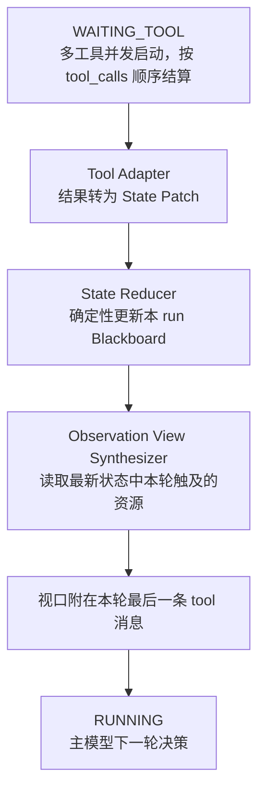

# 工具结果回灌与 Observation 视口

`electron/observationState.cjs` 定义 `State Patch`：`domain`、`key`、`operation`、`callId` 和结构化 `value`。适配器依据工具名、参数和返回状态确定资源域与键。`read_file` 等同一资源的后续成功结果覆盖旧值；失败和部分成功进入诊断域，不覆盖已确认的资源值。独立调用按 `callId` 追加。reducer 按 assistant 声明的工具顺序应用 patch，因此并发完成顺序不会改变最终状态。

Blackboard 只在当前 `runAgentChat` 中保存。视口从最新 Blackboard 读取本轮更新，优先展示失败与部分成功，并受字符预算约束。每次调用的模型可见内容仍保留在各自的 `tool` 消息中，`tool_call_id` 配对不变。视口附在本轮最后一条 `tool` 消息内，维持工具结果的信任级别，也能继续由上下文预算裁剪。现有超大结果压缩子代理可在适配前压缩模型可见内容；状态归类与合并不再额外调用模型。
