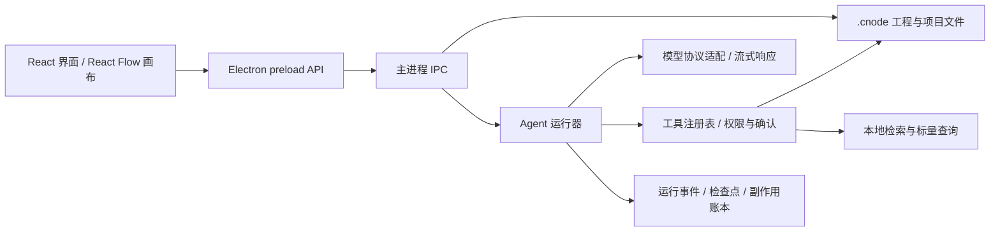

# CodeNode 架构说明

[返回项目首页](../../README.md)

本页说明桌面端数据流、单 Agent ReAct 状态机、多 Agent 协作，以及工具与存储边界。

## 架构

### 桌面端与数据流

| 层 | 职责 | 主要代码 |
| --- | --- | --- |
| 渲染层 | 对话、画布、文件树、运行与恢复界面 | `src/components/`、`src/store/` |
| preload 与 IPC | 向界面暴露受控 API，连接主进程 | `electron/preload.cjs`、`electron/ipc/` |
| Agent 运行器 | ReAct 循环、流式调用、上下文与运行状态 | `electron/agent.cjs`、`electron/agentState.cjs` |
| 工具与子代理 | 参数契约、权限、确认、调度和结果审查 | `electron/tools/`、`electron/subagents.cjs` |
| 工程与恢复 | `.cnode` 编解码、Run 事件、检查点、幂等记录 | `electron/cnode.cjs`、`electron/runStore.cjs`、`electron/runCheckpoint.cjs` |
| 检索 | 项目文件索引、BM25/向量检索、标量查询 | `electron/rag/`、`electron/vectorStore/`、`electron/scalars/` |

### 单 Agent：ReAct 状态机

一次 Agent Run 从 `RUNNING` 开始。模型若给出最终答复，进入 `COMPLETED`；若提出工具调用，则在本轮流式响应结束并完成结构校验后进入 `WAITING_TOOL`，执行工具并将结果作为 `tool` 消息写回对话，再回到 `RUNNING`。需要审批或向用户提问时进入 `WAITING_USER`。`FAILED`、`CANCELLED` 和 `LIMIT_REACHED` 是其他终态。

图中的 **ACTIVE 是为了阅读方便画出的活动态分组，不是代码里的第八个状态**。普通工具失败通常会作为工具结果交给模型判断下一步；流损坏、运行错误、用户取消或预算触顶才按各自终止规则处理。流式 `tool_call` 会先累加与校验，参数未完成或本轮因长度截断时不会直接执行。可选的 Observation/Blackboard 会把一轮工具结果整理成当前观察摘要，但不替代原始工具记录。

恢复由 `runStore` 事件、`runCheckpoint` 检查点和 `sideEffects` 幂等账本共同决定。`planResume` 把旧 Run 分成可自动续跑、需人工复核、已完成或无法判断；结果未知的外部副作用不会被盲目重放。

### 多 Agent：主 Agent 委派与确认

主 Agent 本身仍执行上面的 ReAct 循环。它调用 `delegate_task` / `delegate_tasks` 时，`SubagentManager` 为子任务建立各自的提示词、对话、角色权限、时限和预算，并再次调用同一个 `runAgentChat`。子任务不是把主 Agent 的上下文完整复制一份。

| 角色 | 负责什么 | 主要边界 |
| --- | --- | --- |
| `explorer` | 只读定位文件、结构与证据 | 不改文件，不执行命令 |
| `builder` | 在任务范围内修改源码或画布 | 写操作受权限和确认约束 |
| `verifier` | 运行构建、检查或测试并报告输出 | 不修改被测源码 |
| `reviewer` | 独立检查质量、边界与风险 | 只读，不替实现者改代码 |
| `canvas` | 修改、连接、保存画布 | 不写项目源码文件 |

子任务走统一 FIFO 调度器，默认最多同时运行 **3** 个。满足条件的只读任务可以并行，共享工作区写任务独占；选择 `isolation=worktree` 时，项目文件可在独立 Git 工作树中隔离，画布角色不支持该模式。角色能用哪些工具，由 `electron/tools/roles.cjs` 的白名单与能力契约约束。

每个子 Agent 返回带状态、摘要、产物和证据的结果信封。主 Agent 可用 `get_subagent_task` 核对产物与来源，必要时委派 `verifier` 独立复跑；然后用 `review_subagent_result` 确认或撤回。**只有有效的已确认摘要**才能通过 `dependsOnTaskIds` 传给下游任务。合并报告仍只是候选；撤回或结果失效会使依赖任务需要重新核对。

### 工具、检索和存储边界

- 工具由注册表校验参数、能力和确认策略。项目文件属于项目根目录；写入、命令与外部网络能力按各自契约执行，过程留审计记录。
- 本地 Agentic RAG 为项目文件建立 BM25 索引，可选向量后端（默认进程内 `memory`；也可配置 SQLite 或 Milvus）。检索命中只帮助定位，引用仍需对应本轮实际读取的来源。设置入口在底部工作台的“检索设置”页。
- `.cnode` 是工程容器，保存图、会话、工作区和完整性信息；`.codenode/` 存项目级运行记录、索引、标量等数据。模型列表保存在 Electron 用户数据目录，界面保存的 API Key 需要系统安全存储可用；项目级 `.codenode/agent.properties` 中的可选集成凭据按普通项目文件管理。
- Dify 是**可选的单向调用**：在项目 `.codenode/agent.properties` 配置 `dify.enabled/base/api_key/kind` 后才注册 `dify_call`，调用已发布的 Dify 工作流或聊天应用，并需网络权限及执行前确认。未配置时本地任务不依赖 Dify。详见 [Dify 集成说明](../codenode-dify-improvement-proposal.md)。
